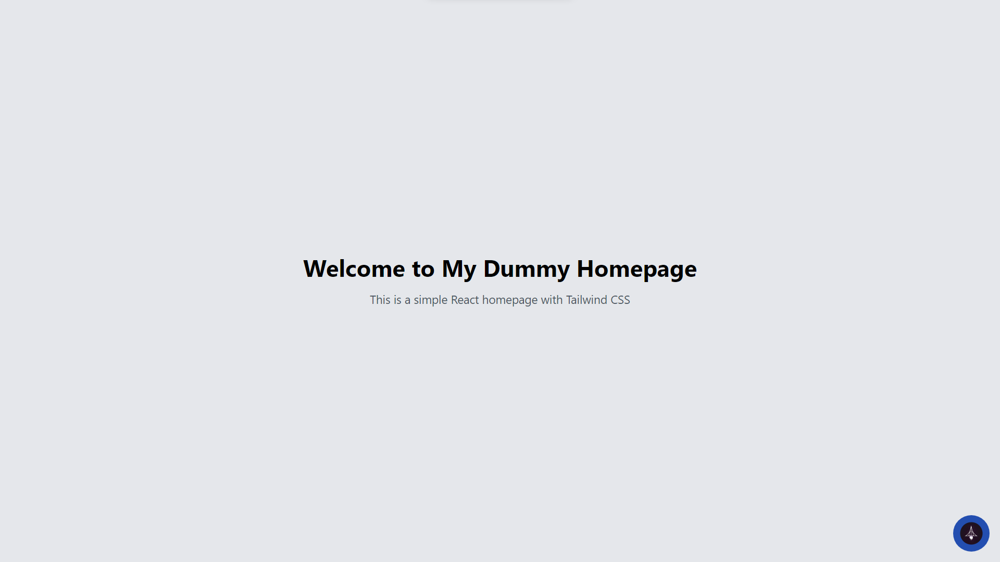
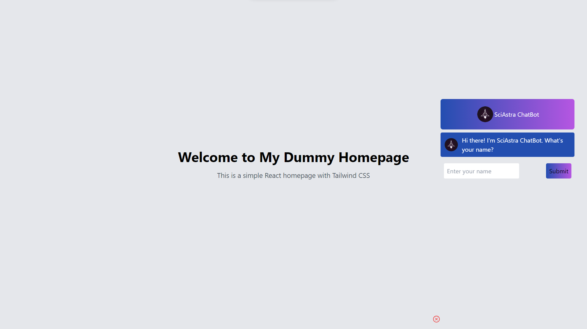
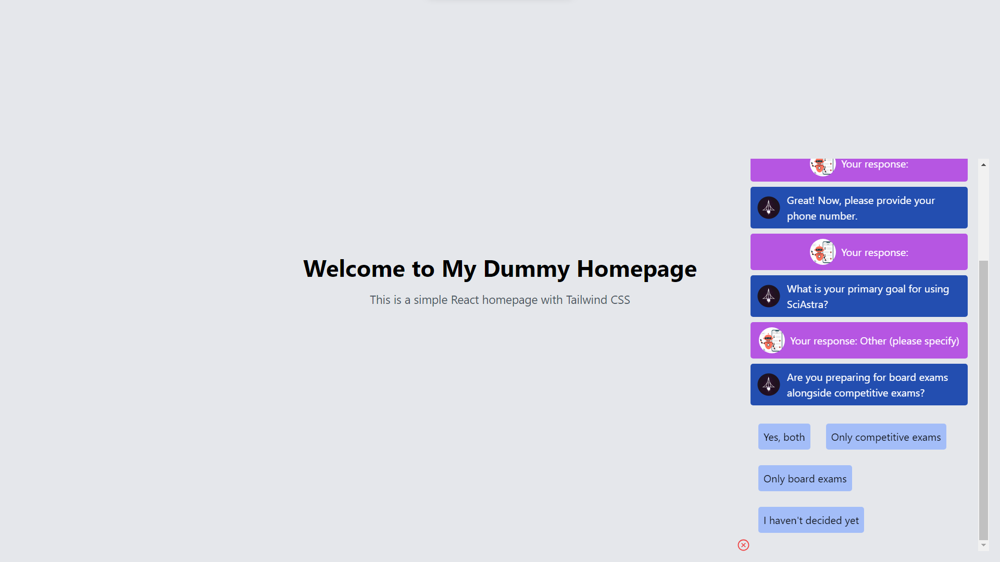
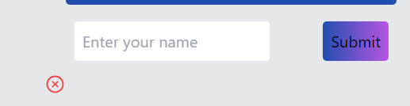

# Chatbot Project

## Overview

This project is a chatbot built using React and Tailwind CSS. It allows users to interact with a chat interface and provides a simple and engaging conversational experience.

## Table of Contents
- [Installation](#installation)
- [Development](#development)
- [Linting](#linting)
- [Preview](#preview)
- [Project Structure](#project-structure)
- [Chat Component](#chat-component)
- [Homepage Component](#homepage-component)
- [Dependencies](#dependencies)
- [Dev Dependencies](#dev-dependencies)
- [Contact](#contact)

## Preview

##### Homepage


##### Chatbot



##### Close Chatbot



## Installation

To get started with the chatbot, follow these installation steps:

1. Clone the repository:
    ```bash
    git clone [https://github.com/godspeed-03/Chatbot-by-react.git]
    cd chatbot
    ```

2. Install dependencies:
    ```bash
    npm install
    ```

## Development

To run the chatbot in development mode, use the following command:

```bash
npm run dev
```


## License
This project is licensed under the MIT License.
